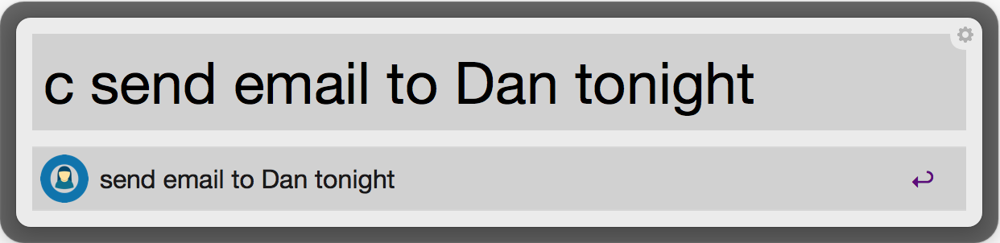

#Carla.io Workflow for [Alfred 2](http://www.alfredapp.com/)
You can now quickly send messages to Carla without needing to pull out your phone / open iMessage or pushbullet. They keyword is "c" (example ```c remind me to complete project tonight```).

You have to enter your access token into the ```config.py``` folder
````
# config.py
ACCESS_TOKEN="{YOUR_ACCESS_TOKEN}"
````
Your access token can be found [here](https://www.pushbullet.com/account).

[Download](https://github.com/packal/repository/raw/master/com.drive.azai91/google_drive.alfredworkflow)



##Commands
- ```c > device```
- ```c {query}```
